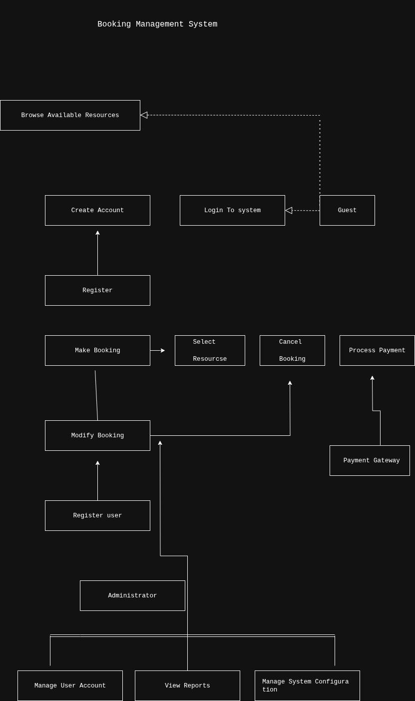

# Requirement Analysis in Software Development

This repository contains requirement analysis documentation for a booking management system project, following industry-standard practices for software development.

## What is Requirement Analysis?

Requirement Analysis is a critical phase in the Software Development Life Cycle (SDLC) that focuses on identifying, documenting, and validating the needs and constraints that a software system must satisfy. It serves as the foundation for all subsequent development activities and ensures that the final product aligns with business objectives and user expectations.

### Importance in SDLC

Requirement Analysis plays a vital role in the SDLC for several reasons:

1. **Foundation for Development**: Provides the blueprint that guides all design, implementation, and testing activities
2. **Risk Mitigation**: Helps identify potential issues and contradictions early in the process
3. **Cost Efficiency**: Reduces rework and changes during later stages by establishing clear requirements upfront
4. **Stakeholder Alignment**: Ensures all parties (clients, users, developers) share a common understanding of the system
5. **Quality Assurance**: Forms the basis for test cases and acceptance criteria
6. **Scope Management**: Helps prevent scope creep by clearly defining project boundaries

The process typically involves gathering requirements from stakeholders, analyzing them for completeness and consistency, prioritizing needs, and documenting them in a clear, unambiguous manner that can be understood by both technical and non-technical audiences.

## Why is Requirement Analysis Important?

Requirement Analysis is crucial in the SDLC for several key reasons:

1. **Prevents Costly Errors and Rework**
   Identifying and clarifying requirements early helps avoid misunderstandings that could lead to expensive changes later in development. Fixing errors during requirements phase is significantly cheaper than during coding or testing phases.

2. **Ensures Stakeholder Alignment**
   It serves as a communication bridge between business stakeholders and technical teams, ensuring everyone has a shared understanding of what needs to be built and why. This alignment reduces conflicts and ensures the final product meets business objectives.

3. **Forms the Foundation for Quality Assurance**
   Well-defined requirements provide the basis for creating comprehensive test cases and acceptance criteria. This ensures the developed software can be properly validated against agreed-upon standards and user expectations.

4. **Manages Project Scope Effectively**
   Clear requirements help prevent scope creep by establishing defined boundaries for the project. This enables better project planning, resource allocation, and timeline estimation.

5. **Enhances User Satisfaction**
   By thoroughly understanding and documenting user needs, requirement analysis ensures the final product will actually solve the problems it was intended to address, leading to higher user adoption and satisfaction.

## Key Activities in Requirement Analysis

Requirement Analysis involves several critical activities that transform stakeholder needs into detailed, actionable specifications:

* **Requirement Gathering**
  The process of collecting information about the system requirements from various stakeholders through techniques like interviews, surveys, workshops, and observation. This activity focuses on understanding what different users need from the system.

* **Requirement Elicitation**
  The proactive process of extracting hidden or unexpressed requirements from stakeholders. This goes beyond simple gathering to uncover underlying needs through techniques like prototyping, brainstorming, and use case analysis.

* **Requirement Documentation**
  The systematic recording of requirements in a structured format such as Software Requirements Specification (SRS) documents, user stories, or requirement matrices. This creates a formal reference that guides development and testing activities.

* **Requirement Analysis and Modeling**
  The process of examining requirements for consistency, completeness, and feasibility. This involves creating visual models like data flow diagrams, entity-relationship diagrams, and state transition diagrams to represent system functionality and relationships.

* **Requirement Validation**
  The critical review process where stakeholders confirm that documented requirements accurately represent their needs. This includes techniques like reviews, walkthroughs, and developing acceptance criteria to ensure requirements are testable and verifiable.

## Types of Requirements

Software requirements are typically categorized into two main types: functional requirements and non-functional requirements.

### Functional Requirements

Functional requirements describe what the system should do - the specific behaviors, functions, and features that the system must implement. These are typically expressed as services, tasks, or functions that the system is required to perform.

**Examples for a Booking Management System:**

* User Registration and Authentication
  * The system shall allow users to create an account with email and password
  * The system shall provide password recovery functionality
  * The system shall allow users to log in and log out

* Booking Management
  * The system shall allow users to search for available resources
  * The system shall allow users to make, modify, and cancel bookings
  * The system shall display booking confirmation details

* Payment Processing
  * The system shall integrate with payment gateways to process transactions
  * The system shall generate and email receipts for completed transactions

* Administration
  * The system shall allow administrators to view and manage all bookings
  * The system shall allow administrators to generate booking reports

### Non-Functional Requirements

Non-functional requirements describe how the system should perform - the quality attributes, constraints, and performance goals that the system must meet. These define the system's quality characteristics rather than specific behaviors.

**Examples for a Booking Management System:**

* Performance Requirements
  * The system shall respond to user requests within 2 seconds under normal load
  * The system shall support up to 1000 concurrent users

* Security Requirements
  * The system shall encrypt all sensitive user data both in transit and at rest
  * The system shall implement role-based access control for different user types

* Reliability Requirements
  * The system shall maintain 99.9% uptime during business hours
  * The system shall automatically save user progress during multi-step processes

* Usability Requirements
  * The system interface shall be intuitive enough for novice users to complete a booking within 5 minutes
  * The system shall provide clear error messages and recovery options

* Compatibility Requirements
  * The system shall be compatible with current versions of major web browsers
  * The system shall provide a responsive design for mobile devices

## Use Case Diagrams

Use Case Diagrams are visual representations of the interactions between system actors (users or external systems) and the system itself. They illustrate the various ways that users might interact with a system to achieve specific goals.

### Benefits of Use Case Diagrams

1. **Visual Communication**: Provide an easily understandable overview of system functionality
2. **Requirement Clarification**: Help identify and clarify system requirements
3. **Stakeholder Alignment**: Ensure all parties have a shared understanding of system capabilities
4. **Scope Definition**: Help define the boundaries of the system
5. **Testing Foundation**: Serve as a basis for developing test cases

### Booking System Use Case Diagram

The following diagram illustrates the key use cases for the booking management system:

**Actors in the System:**
- Guest (unauthenticated user)
- Registered User
- Administrator
- Payment Gateway (external system)

**Key Use Cases:**
- Browse available resources
- Create account
- Login to system
- Make booking
- Cancel booking
- Process payment
- Manage user accounts
- Generate reports
- Manage system configuration

## Acceptance Criteria

Acceptance Criteria are predefined conditions that a software product must satisfy to be accepted by stakeholders. They serve as the definitive requirements that determine when a user story or feature is complete and working as intended.

### Importance in Requirement Analysis

Acceptance Criteria play a crucial role in requirement analysis for several reasons:

1. **Clarity and Precision**: Provide unambiguous definitions of what constitutes a completed feature
2. **Testability**: Serve as the basis for creating test cases and validation procedures
3. **Scope Management**: Prevent scope creep by clearly defining feature boundaries
4. **Stakeholder Alignment**: Ensure all parties agree on what constitutes a successfully implemented feature
5. **Quality Assurance**: Establish measurable standards for feature completion and performance

### Example: Checkout Feature Acceptance Criteria

For the checkout feature in our booking management system, the acceptance criteria might include:

1. **Payment Processing**
   - Given a user has selected items to book, when they proceed to checkout, then the system shall display a summary of their booking with total cost
   - Given a user is at the checkout page, when they enter valid payment information, then the system shall process the payment successfully
   - Given a user enters invalid payment information, when they attempt to complete checkout, then the system shall display an appropriate error message

2. **Confirmation and Notification**
   - Given a successful payment, when the transaction completes, then the system shall generate a booking confirmation number
   - Given a completed booking, when the transaction finishes, then the system shall send a confirmation email to the user

3. **Error Handling**
   - Given a network interruption during payment processing, when connectivity is restored, then the system shall provide options to retry or cancel the transaction
   - Given an expired payment session, when a user attempts to complete checkout, then the system shall redirect to the booking summary page

4. **User Experience**
   - Given a user is at checkout, when they navigate away from the page, then the system shall preserve their cart contents for at least 24 hours
   - Given a user completes checkout, when they return to the site, then the system shall display their booking in the "My Bookings" section

5. **Security Requirements**
   - Given any step in the checkout process, when handling sensitive information, then the system shall use encrypted connections (HTTPS)
   - Given payment information, when stored in the system, then it shall be encrypted following PCI DSS compliance standards

These acceptance criteria provide clear, testable conditions that must be met for the checkout feature to be considered complete and satisfactory.